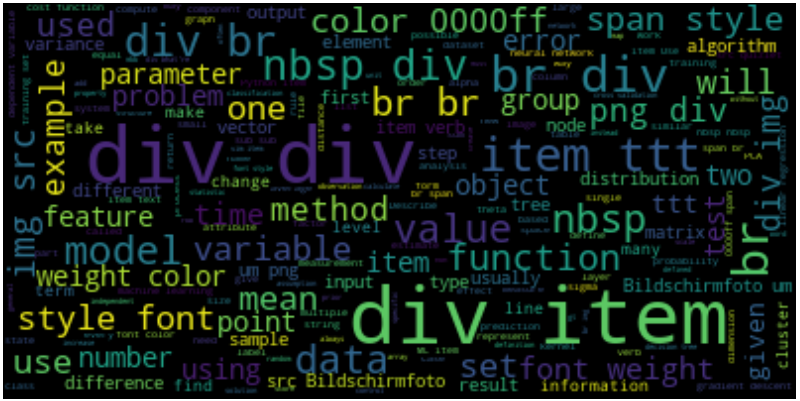
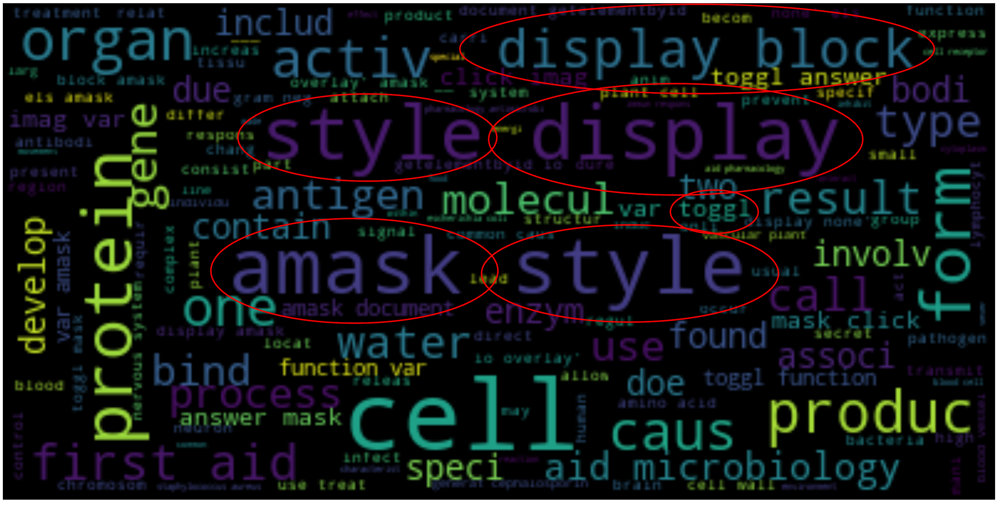
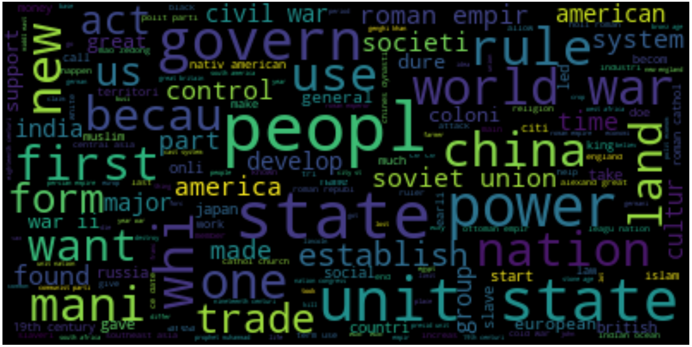

# In Search of a Smarter Flashcard
## Part 1: Discerning Topics, Pedagogical Implications
#### Tovio Roberts, Capstone 2 @Galvanize

 
 
 
 
 
 
 
 
 
 
 
--------------------------------------------------------------------------------
## **Questions:**
1. How can we clean and cluster/discern topics in a pool of flash cards in a ‘reasonable’ way through use of NLP techniques?
2. How will clustering/topic modeling generalize to a new pool of flash cards.
3. What is an effective structure to discern strong and weak subjects for an individual who regularly reviews flash cards.
--------------------------------------------------------------------------------
## **Technologies Used**
  * Python, sklearn
  * Sklearn's Latent Dirichlet Allocation
  * WordCloud
  * [pyLDAvis](https://pyldavis.readthedocs.io/en/latest/)
--------------------------------------------------------------------------------
### **PROJECT PROGRESSION Minimum Viable Product:**
1. Create data cleaning pipeline.
    * Strip html from cards
    * Standardize, modify or ignore formulas that are not consistent across cards.
    * Modify entries that lead to erroneous topics.
2. Explore NLP strategies to allow for meaningful clustering
    * Stem, Lemmatize, Stopwords
    * Count Vector
    * TF-IDF Vector
3. Use Topic Modeling to analyze topics within a single subject corpus.
    * Determine if discerned topics are sensible
4. Apply same Topic modeling to the full pool of cards
    * Provide list of salient and relevant words for each topic.

--------------------------------------------------------------------------------
### **GOALS:**
- Clean flash card pool in a way that can be generalized to new card content
- Topic Model so as to enable simple similarity selection in an application
- Discuss discerning strong and weak subjects for a user
  - How to deliver the most "helpful" study materials
  - Associative Database --> Extrapolative Learning
--------------------------------------------------------------------------------

## **Problem Context**
- Learning is non-linear, extrapolative and diverse
- Traditional Education tends to be linear, grade-focused and "forgetful"
- Discerning underlying patterns of topics in a corpus of educational materials (such as flashcards, assignments) has the potential to facilitate extrapolative study
--------------------------------------------------------------------------------
## **Inspirations**
- [Anki](http://ankisrs.net) - Spaced-Repetition flash card program
- [PiggyDB](https://piggydb.net/) - associative, tag-based database for study and extrapolation
- [KhanAcademy](http://khanacademy.org) - Exploratory, non-grade-based educational model
- [Moonwalking with Einstein](https://joshuafoer.com/) by Joshua Forrer - Memory Palaces/Method of Locii
--------------------------------------------------------------------------------
## **The DATA:**
3 collections of ~12,000 each, flash cards, ~36,000 total.  These are divided into 3 general categories:
- Data Science
- Biology
- History

#### Each "card" is composed of a question and an answer.

The data sets are compiled from three sources:
- AnkiWeb
- Quizlet
- My collection
--------------------------------------------------------------------------------
## **The Data:** 1 observation == 1 Flash Card
- Front:
  - Can be in the form of a question, an Imperative (e.g., “Describe the Bernoulli Distribution:”)
  - May contain the majority of information from the observation as in the case of giving a definition and requesting the corresponding term.
    - Important to consider when later attempting to train an NN to write questions corresponding to answers.

- Back:
  - Effectively the same as the front.

--------------------------------------------------------------------------------
## **The Data:** Cleaning
- Front and Back may contain images, formulas, inconsistent vocabulary
Off-topic cards are likely present
  - Formulas have variety of representations
  - Images must be stripped

--------------------------------------------------------------------------------
## **The Data:** What it looks like RAW

- This is the raw data from the Data Science FlashCard deck

#### We Need to...
* Strip html from cards
* Standardize, modify or ignore formulas that are not consistent across cards.
* Modify entries that lead to erroneous topics.
--------------------------------------------------------------------------------
## **Cleaning...**

--------------------------------------------------------------------------------
### A given Row, after cleaning

--------------------------------------------------------------------------------

### Data Science Cards Cleaned and Stemmed:

--------------------------------------------------------------------------------
### Biology Cards Cleaned (sort of) and Stemmed:

- There are some artifacts from javascript here that will need to be cleaned up eventually.
  - But, what if we have flashcards about javascript???
- We will see these erroneous words (`amask`, `display`) reappear during topic modeling.
--------------------------------------------------------------------------------
### History Cards Cleaned and Stemmed:

--------------------------------------------------------------------------------
## Let's Look at the Whole Corpus (the 3 decks combined)

--------------------------------------------------------------------------------
## How do the 3 decks compare to each other?
### Some Selected Word Counts:

--------------------------------------------------------------------------------

## Topic Modeling with Latent Dirichlet Allocation (LDA)
* Tried [NMF (Non-negative matrix factorization)](https://en.wikipedia.org/wiki/Non-negative_matrix_factorization) and [LSI (Latent semantic indexing)](https://en.wikipedia.org/wiki/Latent_semantic_analysis#Latent_ semantic_indexing)
* "LDA yields list of salient groups of related words over a collection, with documents represented as a mixture of these groups."
* LDA has a pretty cool visualization tool: [pyLDAvis](https://pyldavis.readthedocs.io/en/latest/)
* A document is a probability distribution over topics
* A topic is a probability over words
--------------------------------------------------------------------------------
## Inputs to the LDA Model
* Word 1-grams, due to increased dimensions
* Used both TF Matrix and TF-IDF Matrix as input, after reading that TF Matrices are the preferred input to LDA
  * Radim Řehůřek, who authored Gensim, a topic modeling toolkit, says:
    - `" LDA -- in theory, it only works over plain bag-of-words (integers). The theory doesn't make sense over floats. But the floats/integers distinction makes no difference to the LDA implementation in gensim, so I tried it over tfidf too, and personally found the tfidf results better :) But I didn't do any rigorous evaluation of this, so ymmv; best if you see how it behaves on your own data. "`
  * tf-idf is at the word level and can identify sets of words that are discriminative for documents in the collection
  * LDA can determine co-occurrence of words in a collection and can be analyzed to discern topics

--------------------------------------------------------------------------------
## **Quick Aside:** Working toward Simple MVC

- Flash Card Pool: all flash cards in original form
  - fields may contain latex, html
- Topic Distribution Table:
  - If Using LDA, contains a mixture of topic probabilities for each card
- Successes:
  - Integer count of successes/misses, for each card
  - For [Spaced Repetition](https://en.wikipedia.org/wiki/Spaced_repetition), records last time viewed

--------------------------------------------------------------------------------
### LDA on the Full Corpus Separates Out the Three Types Rather Definitively

* Left side of the Plot is MDS (MultiDimensional Scaling) using PCA
  * using Jensen-Shannon divergence as distance measurement between distributions
* Size of Topic indicates the prevalence of a given topic, with 1 being most prevalent
--------------------------------------------------------------------------------
### List of Interactive Visualizations
* [Interactive LDA on Term Freq Matrix of Full Corpus](images/all_count_vect_topics.html)
* [Interactive LDA on TF-IDF Matrix of Full Corpus](images/all_tfidf_vect_topics.html)
* [Interactive LDA on Term Freq Matrix of Biology Subcorpus](images/bio_count_vect_topics.html.html)
* [Interactive LDA on TF-IDF Matrix of Biology Subcorpus](images/bio_tfidf_vect_topics.html)
* [Interactive LDA on Term Freq Matrix of Data Science Subcorpus](images/datascience_count_vect_topics.html)
* [Interactive LDA on TF-IDF Matrix of Data Science Subcorpus](images/datascience_tfidf_vect_topics.html)
* [Interactive LDA on Term Freq Matrix of History Subcorpus](images/his_count_vect_topics.html)
* [Interactive LDA on TF-IDF Matrix of History Subcorpus](images/his_tfidf_vect_topics.html)

-------------------------------------------------------------------------------
## **Insights:**
* The three subcorpora separated well... a little too well
  * What underlying associations will more topics elicit?
* Cleaning data is time-consuming

-------------------------------------------------------------------------------
## **Further Exploration:**
* Topic coherence metrics in light of computation overhead
  * Find optimal number of topics
  * Optimal max iterations
* Attempt Word2Vec clustering/topic modeling
* Attempt Doc2Vec and Word Mover's Distance
-------------------------------------------------------------------------------
## **Next Steps**

### *Improvement 1: Provide a simple API for flashcards*
1. Build topic distribution table when new cards are added
2. Retrieve flashcard by function of similarity, success and last time reviewed
3. Update success table for flashcard user

### *Improvement 2: Provide an Interface for Card Review*
1. Swipe Left/Swipe Right simple front end.
2. Update success/fail.
3. Discern “Strong” and “Weak” topics.

### *Improvement 3: Smart Flashcard Delivery*
1. Incorporate Spaced Repetition and randomness settings into reviews.
2. Use similarity metrics to discern “Weak” and “Strong” topics, based on card review successes.
3. Deliver review cards as a function of spaced repetition, strength, and similarity.
