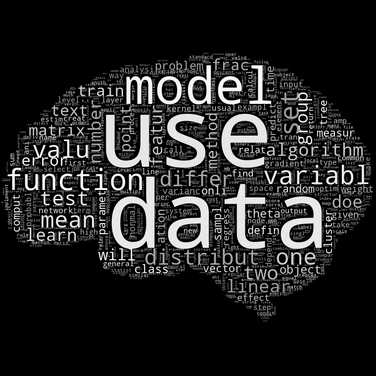
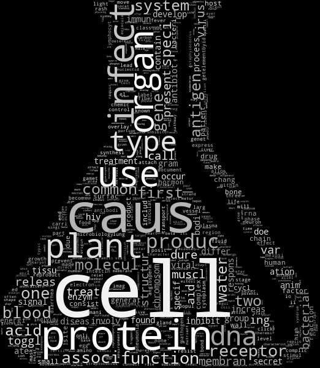
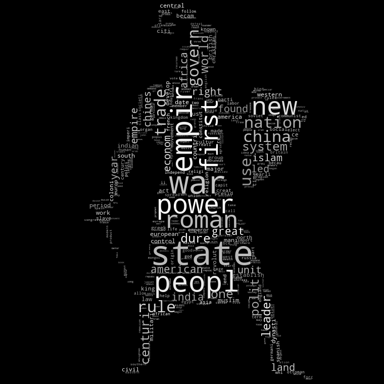
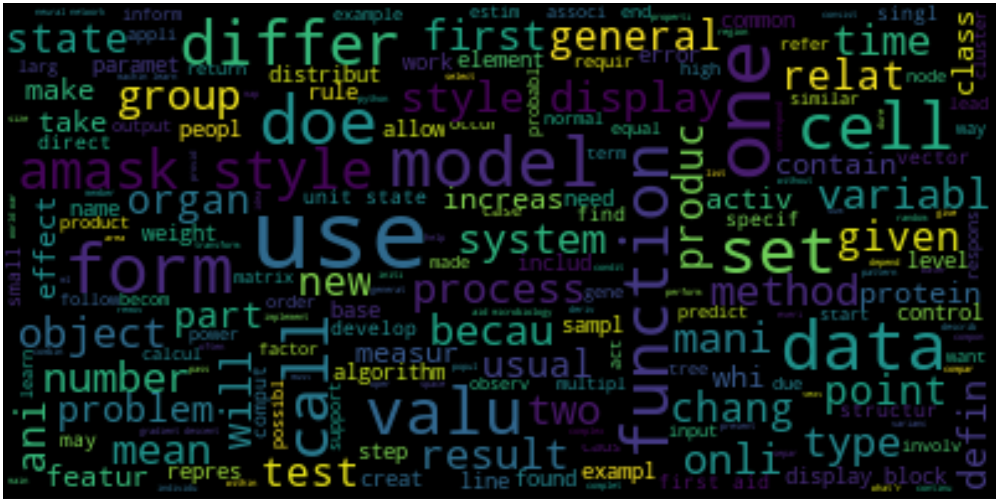

### I am currently updating this documentation to reflect:
* simple flashcard recommender app using flask
* "optimal" number of topics/metrics proposals for LDA
* visualizations of growing corpus, cluster cohesion and topic coherence

# In Search of a Smarter Flashcard
## Part 1: Discerning Topics, Pedagogical Implications
#### Tovio Roberts, Capstone 2 @Galvanize

 
 
 

--------------------------------------------------------------------------------
## **Questions:**
1. How can we clean and discern topics in a pool of flash cards in a ‘reasonable’ way through use of NLP techniques?
2. How will the topic model generalize to a new pool of flash cards.
3. What is an effective structure to discern strong and weak subjects for an individual who regularly reviews flash cards.
 
 
 
 
 
 
 
 
 
 
 

--------------------------------------------------------------------------------
## **Technologies Used**
  * Python, sklearn
  * [Sklearn's Latent Dirichlet Allocation](http://scikit-learn.org/stable/modules/generated/sklearn.decomposition.LatentDirichletAllocation.html)
  * [WordCloud](https://github.com/amueller/word_cloud)
  * [pyLDAvis](https://pyldavis.readthedocs.io/en/latest/)
 
 
 
 
 
 
 
 
 
 
 

--------------------------------------------------------------------------------
### **PROJECT PROGRESSION Minimum Viable Product:**
1. Create data cleaning pipeline.
    * Strip html from cards
    * Standardize, modify or ignore formulas that are not consistent across cards.
    * Modify entries that lead to erroneous topics.
2. Explore NLP strategies to allow for meaningful clustering
    * Stem, Lemmatize, Stopwords
    * Count Vector
    * TF-IDF Vector
3. Use Topic Modeling to analyze topics within a single subject corpus.
    * Determine if discerned topics are sensible
4. Apply same Topic modeling to the full pool of cards
    * Provide list of salient and relevant words for each topic.

 
 
 
 
 
 
 
 
 
 
 

--------------------------------------------------------------------------------
### **GOALS:**
- Clean flash card pool in a way that can be generalized to new card content
- Topic Model so as to enable simple similarity selection in a future application
- Discuss discerning strong and weak subjects for a user
  - How to deliver the most "helpful" study materials
  - Associative Database --> Extrapolative Learning
 
 
 
 

--------------------------------------------------------------------------------

## **Problem Context**
- Learning is non-linear, extrapolative and diverse
- Traditional Education tends to be linear, grade-focused and "forgetful"
- Discerning underlying patterns of topics in a corpus of educational materials (such as flashcards, assignments) has the potential to facilitate extrapolative study
 
 
 
 
 
 
 
 
 
 
 

--------------------------------------------------------------------------------
## **Inspirations**
- [Anki](http://ankisrs.net) - Spaced-Repetition flash card program
- [PiggyDB](https://piggydb.net/) - associative, tag-based database for study and extrapolation
- [KhanAcademy](http://khanacademy.org) - Exploratory, non-grade-based educational model
- [Moonwalking with Einstein](https://joshuafoer.com/) by Joshua Forrer - Memory Palaces/Method of Locii
 
 
 
 
 
 
 
 
 
 
 

--------------------------------------------------------------------------------
## **The DATA:**
3 collections of ~12,000 each, flash cards, ~36,000 total.  These are divided into 3 general categories:
- Data Science
- Biology
- History

#### Each "card" is composed of a question and an answer.

The data sets are compiled from three sources:
- AnkiWeb
- Quizlet
- My collection
 
 
 
 
 
 
 
 
 
 
 

--------------------------------------------------------------------------------
## **The Data:** Cleaning
- Front and Back may contain images, formulas, inconsistent vocabulary
Off-topic cards are likely present
  - Formulas have variety of representations
  - Images must be stripped
  - HTML, LateX, and Javascript

## **The Data:** 1 observation == 1 Flash Card
- Front:
  - Can be in the form of a question, an Imperative (e.g., “Describe the Bernoulli Distribution:”)
  - May contain the majority of information from the observation as in the case of giving a definition and requesting the corresponding term.
    - Important to consider when later attempting to train an NN to write questions corresponding to answers.

- Back:
  - Effectively the same as the front.
 
 
 
 
 
 
 
 
 
 
 

--------------------------------------------------------------------------------
## **The Data:** What it looks like RAW

- This is the raw data from the Data Science FlashCard deck

#### We Need to...
* Strip html from cards
* Standardize, modify or ignore formulas that are not consistent across cards.
* Modify entries that may lead to erroneous topics.
 
 
 
 
 
 
 
 
 
 
 

--------------------------------------------------------------------------------
## **Cleaning...**

 
 
 
 
 
 
 
 
 
 
 

--------------------------------------------------------------------------------
### A given Row, after cleaning

 
 
 
 
 
 
 
 
 
 
 

--------------------------------------------------------------------------------

### Data Science Cards Cleaned and Stemmed:

 
 
 
 
 
 
 
 
 
 
 

--------------------------------------------------------------------------------
### Biology Cards Cleaned and Stemmed:

- There were some artifacts from javascript snippets here that I removed manually.
  - Keep in mind that such a decision is somewhat arbitrary and would adversely affect flash cards on the subject of javascript.
 
 
 
 
 
 
 
 
 
 
 

--------------------------------------------------------------------------------
### History Cards Cleaned and Stemmed:

 
 
 
 
 
 
 
 
 
 
 

--------------------------------------------------------------------------------
## Let's Look at the Whole Corpus (the 3 decks combined)

 
 
 
 
 
 
 
 
 
 
 

--------------------------------------------------------------------------------
## How do the 3 decks compare to each other?
### Some Selected Word Counts:

 
 
 
 
 
 
 
 
 
 
 

--------------------------------------------------------------------------------

## Topic Modeling with Latent Dirichlet Allocation (LDA)
* Tried [NMF (Non-negative matrix factorization)](https://en.wikipedia.org/wiki/Non-negative_matrix_factorization) and [LSI (Latent semantic indexing)](https://en.wikipedia.org/wiki/Latent_semantic_analysis#Latent_ semantic_indexing)
* "LDA yields list of salient groups of related words over a collection, with documents represented as a mixture of these groups."
* LDA has a pretty cool visualization tool: [pyLDAvis](https://pyldavis.readthedocs.io/en/latest/)
* A document is a probability distribution over topics
* A topic is a probability over words

#### e.g.: Row 83 = [0.35, 0.15, 0.05, 0.30, 0.15]
 
 
 
 
 
 
 
 
 
 
 

--------------------------------------------------------------------------------
### LDA Metaphor
* Suppose you want to figure out people's interests (topics) in a city based on where they hang out.

* Go around town and note people (words) hanging out at different places.

* Pick a number K of the most important interest categories people fall into

* Guess as why you see people where you see them, ie "a person is hanging out at the park because they are interested in Interest X. The same person might be seen at a coffee shop because they have interest Y, and people with interest Y like to hang out at the coffee shop."

* The random guesses are very likely to be wrong, to improve them:
  * **Loop through each place and person over and over again**
  1. Pick a place and a person
  2. Ask why is person i likely to be at place j?
    * Likely because other people at place j were drawn there by the same interests.
    * The more people with interests in X there are at the park and the stronger person i is associated with interest X (at all the other places she goes to), the more likely it is that person i is at the park because of interest X.
  3. Make a new guess as to why person i is at the mall, choosing an interest with some probability according to how likely you think it is.

* The guesses will get better and better
  - Coffee snobs at the coffee shop
  - Skaters at the skate park
  - People who like to smell dog poop at the park

* We can start thinking that it's likely that person i is at the park because they like smelling dog poop (or they like that weird bro-ball game with the trampoline).
  * We can start generalizing and guessing that other people are at the park for similar reasons.
  * At some point, we decide we've arrived at a good modeling of people's interests based on where they hang out, as well as likely interests of people who hang out a specific place.
  * We can count people in a category to see how many people have a particular interest
  * We can interpret the category based on the attributes of a person

* For each PLACE and interest CATEGORY, compute the proportions of people at PLACE because of CATEGORY to get a representation of PLACE.
  * e.g., the people who hang out at the park consist of 10% dog-poop-smell-lovers, 50% flow-artists, 10% drone-flyers, and 30% bro-ball-players.

--------------------------------------------------------------------------------
## Inputs to the LDA Model
* Word 1-grams, due to increased dimensions
* Used both TF Matrix and TF-IDF Matrix as input, after reading that TF Matrices are the preferred input to LDA
  * Radim Řehůřek, who authored Gensim, a topic modeling toolkit, says:
    - `" LDA -- in theory, it only works over plain bag-of-words (integers). The theory doesn't make sense over floats. But the floats/integers distinction makes no difference to the LDA implementation in gensim, so I tried it over tfidf too, and personally found the tfidf results better :) But I didn't do any rigorous evaluation of this, so ymmv; best if you see how it behaves on your own data. "`
  * tf-idf is at the word level and can identify sets of words that are discriminative for documents in the collection
  * LDA can determine co-occurrence of words in a collection and can be analyzed to discern topics

 
 
 
 
 
 
 
 
 
 
 

--------------------------------------------------------------------------------
## **Quick Aside:** Working toward Simple MVC

- Flash Card Pool: all flash cards in original form
  - fields may contain latex, html
- Topic Distribution Table:
  - If Using LDA, contains a mixture of topic probabilities for each card
- Successes:
  - Integer count of successes/misses, for each card
  - For [Spaced Repetition](https://en.wikipedia.org/wiki/Spaced_repetition), records last time viewed

 
 
 
 
 
 
 
 
 
 
 

--------------------------------------------------------------------------------
### LDA on the Full Corpus Separates Out the Three Types Rather Definitively

* Left side of the Plot is MDS (MultiDimensional Scaling) using PCA
  * using Jensen-Shannon divergence as distance measurement between distributions
* Size of Topic indicates the prevalence of a given topic, with 1 being most prevalent
 
 
 
 
 
 
 
 
 
 
 

--------------------------------------------------------------------------------
### List of Interactive Visualizations
* [Interactive LDA on Term Freq Matrix of Full Corpus](https://rawgit.com/clownfragment/a-smarter-flashcard/master/images/all_count_vect_topics.html)
* [Interactive LDA on TF-IDF Matrix of Full Corpus](https://rawgit.com/clownfragment/a-smarter-flashcard/master/images/all_tfidf_vect_topics.html)
* [Interactive LDA on Term Freq Matrix of Biology Subcorpus](https://rawgit.com/clownfragment/a-smarter-flashcard/master/images/bio_count_vect_topics.html)
* [Interactive LDA on TF-IDF Matrix of Biology Subcorpus](https://rawgit.com/clownfragment/a-smarter-flashcard/master/images/bio_tfidf_vect_topics.html)
* [Interactive LDA on Term Freq Matrix of Data Science Subcorpus](https://rawgit.com/clownfragment/a-smarter-flashcard/master/images/datascience_count_vect_topics.html)
* [Interactive LDA on TF-IDF Matrix of Data Science Subcorpus](https://rawgit.com/clownfragment/a-smarter-flashcard/master/images/datascience_tfidf_vect_topics.html)
* [Interactive LDA on Term Freq Matrix of History Subcorpus](https://rawgit.com/clownfragment/a-smarter-flashcard/master/images/his_count_vect_topics.html)
* [Interactive LDA on TF-IDF Matrix of History Subcorpus](https://rawgit.com/clownfragment/a-smarter-flashcard/master/images/his_tfidf_vect_topics.html)

 
 
 
 
 
 
 
 
 
 
 

-------------------------------------------------------------------------------
## **Insights:**
* Just at the beginning
* The three subcorpora separated well... a little too well
  * What underlying associations will more topics elicit?
* Cleaning data is time-consuming

 
 
 
 
 
 
 
 
 
 
 

-------------------------------------------------------------------------------
## **Further Exploration:**
* Topic coherence metrics in light of computation overhead
  * Find optimal number of topics
  * Optimal max iterations
* Attempt Word2Vec clustering/topic modeling
* Attempt Doc2Vec and Word Mover's Distance

 
 
 
 
 
 
 
 
 
 
 

-------------------------------------------------------------------------------
## **Next Steps**

### *Improvement 1: Provide a simple API for flashcards*
1. Build topic distribution table when new cards are added
2. Retrieve flashcard by function of similarity, success and last time reviewed
3. Update success table for flashcard user

### *Improvement 2: Provide an Interface for Card Review*
1. Swipe Left/Swipe Right simple front end.
2. Update success/fail.
3. Discern “Strong” and “Weak” topics.

### *Improvement 3: Smart Flashcard Delivery*
1. Incorporate Spaced Repetition and randomness settings into reviews.
2. Use similarity metrics to discern “Weak” and “Strong” topics, based on card review successes.
3. Deliver review cards as a function of spaced repetition, strength, and similarity.
